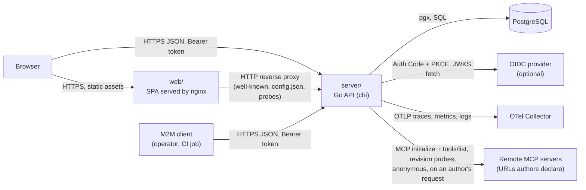
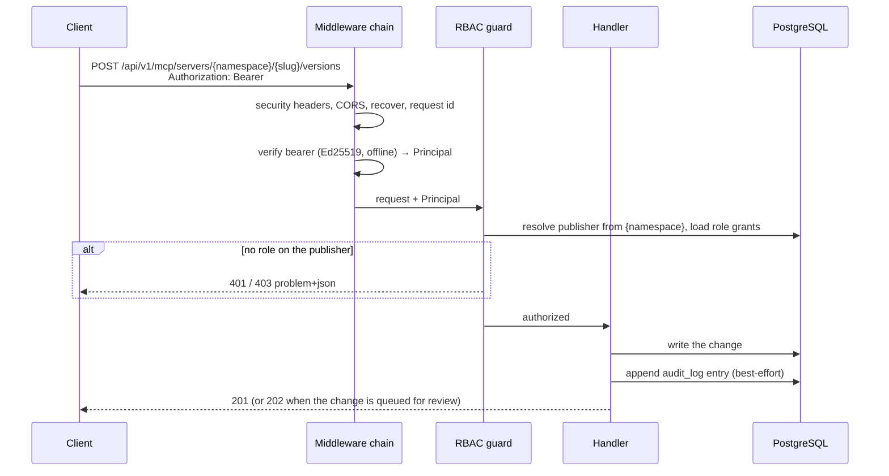
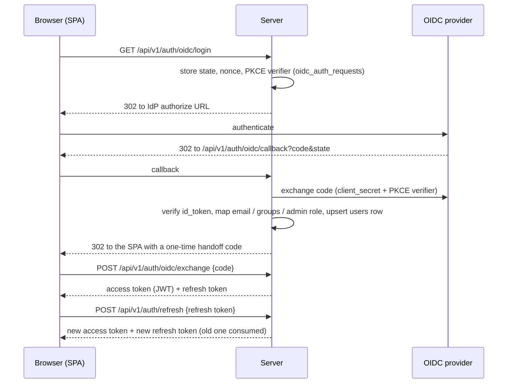
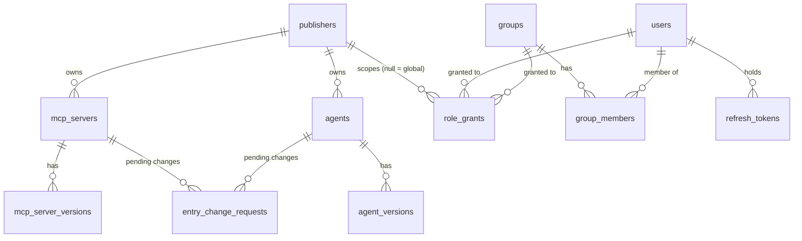
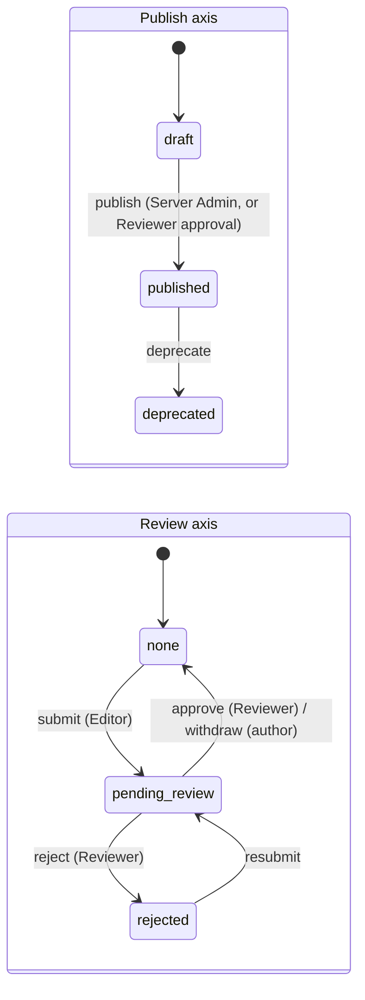

# Architecture

How the AI Registry is put together and why. Commands to run it live in
[README.md](README.md); the development loop lives in
[CONTRIBUTING.md](CONTRIBUTING.md).

## Overview

The registry is one Go HTTP service backed by PostgreSQL, plus a static React
SPA that is purely a client of the service's versioned API. The service owns
every piece of state and every rule: catalog entries (MCP servers, A2A agents),
their immutable versions, the review workflow, publisher-scoped RBAC, and token
issuance. An external OIDC provider is optional and only authenticates people;
it never decides what they may do.

In Kubernetes the Ingress routes `/api` straight to the server and everything
else to nginx, which serves the SPA and forwards the remaining backend paths
(see [web/nginx.conf](web/nginx.conf) and
[the chart's Ingress](deploy/helm/ai-registry/templates/ingress.yaml)). In
docker-compose, nginx (or the Vite dev server) proxies `/api` as well.

## Components

### `server/` — the registry service

The single source of truth. It serves the API under `/api/v1`, the discovery
documents (`/.well-known/jwks.json`, `/.well-known/agent-card.json`, per-agent
cards under `/agents/{namespace}/{slug}/.well-known/agent-card.json`), the
OpenAPI document at `/openapi.yaml`, `/config.json` for the SPA, the
`/healthz` / `/readyz` probes and Prometheus `/metrics`.

On start-up, in order: load configuration, set up OpenTelemetry, run the
database migrations, seed the bootstrap Server Admin, reconcile the
configuration-managed instance tags, apply the optional bootstrap file, then
serve. `SIGINT` / `SIGTERM` first make `/readyz` answer 503 while requests are
still served for the drain delay (`SHUTDOWN_DRAIN_DELAY`), so load balancers stop
routing to the pod before its listener closes; then a graceful
`http.Server.Shutdown` lets in-flight requests finish, followed by a telemetry
flush. See [server/cmd/server/main.go](server/cmd/server/main.go).

| Package | Responsibility |
| --- | --- |
| [`internal/http`](server/internal/http/) | Router, middleware chain, handlers. Decodes requests, calls the store, maps errors to problem documents. |
| [`internal/auth`](server/internal/auth/) | Token authority, refresh tokens, OIDC broker, password hashing, bearer authentication, RBAC guards. |
| [`internal/domain`](server/internal/domain/) | Entity types, the role lattice, validation, lifecycle rules. No I/O. |
| [`internal/store`](server/internal/store/) | Hand-written SQL over `pgx`, migrations runner, seeding. Every query is traced. |
| [`internal/agents`](server/internal/agents/) | Builds A2A Agent Cards from stored agent versions. |
| [`internal/tooldiscovery`](server/internal/tooldiscovery/) | MCP client behind "Fetch from server" and "Detect from server": connects to a remote server's declared URL and transport, runs `tools/list`, probes the protocol revisions it accepts, refuses internal addresses. Stores nothing. |
| [`internal/bootstrap`](server/internal/bootstrap/) | Declarative YAML/JSON loader that upserts publishers, servers and agents. |
| [`internal/config`](server/internal/config/) | Resolves every setting from env, YAML file, then default. |
| [`internal/observability`](server/internal/observability/) | The one OTel SDK setup (tracer, meter, logger providers) and the metric definitions. |
| [`internal/problem`](server/internal/problem/) | RFC 7807 `application/problem+json` responses. |

The server does not render HTML and does not hold user sessions: every request
is authenticated from its own bearer token.

### `web/` — the SPA

Vite + React + React Router + TanStack Query, built to static files and served
by nginx ([web/Dockerfile](web/Dockerfile)). One bundle holds both the public
read-only catalog and the authenticated admin area under `/admin`. It talks to
the server only through the typed client generated from the OpenAPI spec
([web/src/lib/schema.d.ts](web/src/lib/schema.d.ts)), learns which login
methods exist from `/config.json`, and learns the caller's identity and grants
from `GET /api/v1/me`. It is not an OIDC client and never sees an IdP token.

### `deploy/` — packaging

The Helm chart ([deploy/helm/ai-registry](deploy/helm/ai-registry/)) runs the
server and the SPA as two Deployments, with an optional CloudNativePG cluster
for PostgreSQL. The root [docker-compose.yml](docker-compose.yml) runs the same
two images with PostgreSQL, a Keycloak dev realm, and an optional OTel Collector
+ Jaeger.

## Data flow

### A write request

The chain is assembled in
[server/internal/http/router.go](server/internal/http/router.go):
`otelhttp` wraps everything, then security headers → CORS → panic recovery →
request id → bearer authentication → access log → 1 MiB body cap → JSON
content-type guard. Authentication never rejects a request on its own; it
only attaches a principal. The per-route guards (`RequirePublisherRole`,
`RequireAdmin`, the reviewer guard) produce the 401/403. Public reads and the
auth endpoints sit behind a per-IP token-bucket rate limiter.

### Login and token refresh

Local login (`POST /api/v1/auth/login`) skips the IdP and returns the same
token pair. Logout revokes the refresh token and returns the IdP's
RP-initiated logout URL when there is one.

## State and persistence

PostgreSQL is the only datastore; the server is stateless apart from an
in-memory rate-limit table and a cached IdP JWKS. The schema is defined by the
forward-only migrations in [server/migrations/](server/migrations/).

- **Publishers own everything.** Every MCP server and agent belongs to exactly
  one publisher, and its `{namespace}` path segment *is* that publisher's slug.
  Slugs are unique per publisher, not globally.
- **Versions are immutable once published.** A version row is never edited
  after `published_at` is set, because consumers cache server metadata and agent
  cards.
- **`audit_log` and `reports` are polymorphic** (`resource_type` +
  `resource_id`, `target_type` + `target_id`); the bootstrap loader writes
  synthetic audit events too.
- **Auth state**: `refresh_tokens` (hash only, plus the group and admin claims
  snapshotted at login), `oidc_auth_requests` (in-flight login transactions)
  and `auth_handoff_codes` (the one-time SPA handoff, which holds the issued
  token pair until the SPA exchanges it; the exchange deletes the row). Access
  tokens are not otherwise stored. Every replica deletes expired rows from all
  three tables every `AUTH_SWEEP_INTERVAL`; revoked refresh tokens are kept
  until they expire so a replayed one is still recognised as reuse.
- **`instance_tags`** is the registry-wide tag vocabulary. A published version
  freezes the tags it was published with; a tag in use is deactivated rather
  than deleted so frozen versions keep resolving.

### Version lifecycle

Two independent axes. The publish axis decides what public readers see; the
review axis decides who may trigger the next publish-axis transition. Keeping
them apart is what lets a draft be edited and re-reviewed without ever touching
something already published.

Every transition increments the row's `revision`; a stale write gets a
discriminated `409` (`review-revision-mismatch`) rather than clobbering a
concurrent edit. At most one version per entry is pending review at a time.

Entry-level changes — visibility, deprecation, metadata edits — go through the
same review queue via a single `entry_change_requests` table: the pending row
carries the proposed mutation as a JSONB `payload`, and approval dispatches on
`(resource_type, action)` to apply it in the same transaction
([server/internal/store/entrychange.go](server/internal/store/entrychange.go)).
A partial unique index allows one pending entry-change per entry, independently
of the pending version and pending deletion an entry may also have. Agents
mirror MCP servers exactly.

## Design decisions

**The registry is the only token authority.** Both login paths end in a
registry-issued Ed25519 access token and a rotating refresh token. The SPA
never holds an IdP token and there is no multi-issuer validation on the hot
path, so there is one place that owns token lifetime and the registry runs with
no IdP at all — the bootstrap admin logs in locally, which is what a
single-host self-hosted install needs.

**OIDC is brokered server-side as a confidential client.** The client secret
stays on the server and the SPA needs no OIDC library. The handoff code between
the callback and the SPA keeps tokens out of URLs and browser history.

**Bearer header, no cookie.** Credentials are never sent ambiently, so there is
no CSRF surface and no CSRF middleware. The price is that the SPA must hold the
tokens in JavaScript-reachable storage, which makes XSS hygiene (CSP, no raw
HTML rendering) load-bearing. The SPA's CSP therefore allows scripts and
`fetch` to its own origin only, with no inline script and no `eval`. nginx
sets that CSP only on what it serves itself; proxied responses (the API, the
`/docs` reference) carry the server's own policy alone, since a browser
enforces every CSP it receives. Tabs share that storage and serialise
refreshes through a Web Lock, so two tabs never present the same single-use
refresh token.

**Refresh tokens are single-use and stored hashed.** `refresh_tokens` never
holds a raw token, and presenting an already-rotated refresh token revokes its
whole lineage, which turns token theft into a detectable, self-limiting event.
A rotated token keeps its predecessor's expiry, so `REFRESH_TOKEN_TTL` is an
absolute session lifetime from login, not a sliding window. A password change,
a disable or a Server Admin removal revokes all of the user's refresh tokens in
the same transaction. Changing your own password requires the current one, and
a wrong guess counts toward the local-login lockout, so a stolen access token
alone cannot take over the account.

**Tokens carry group membership, never roles.** At login the refresh token
snapshots the IdP's group claim and admin-role flag, and every access token
minted from it carries that snapshot. The snapshot is re-read only at login,
and the refresh lifetime is absolute from login, so an IdP-side change takes
effect within one `REFRESH_TOKEN_TTL`. Per-publisher roles are grants stored in
the registry and resolved on every write, so the IdP does not dictate
authorization and a revoked grant takes effect immediately rather than at token
expiry. There are exactly two principal types: users and groups.

**Reviewer is the only approver.** A publisher Admin can do everything except
approve a change — separation of duties by default. The rule holds per
principal too: whoever submitted a version, a deletion request or an entry
change cannot approve it, even holding Reviewer (`403
self-approval-forbidden`), and nobody but a Server Admin can grant themselves a
role (`403 self-grant-forbidden`). The submitter check runs inside the approve
transaction against the recorded `submitted_by` / `deletion_requested_by`.
Server Admin, derived from the configured IdP admin role or the local
`is_server_admin` flag, is the break-glass exception: it applies changes
immediately (`200`) where an Editor's request is queued (`202`), and may
approve its own submissions.

**Machine callers present IdP tokens directly.** When `OIDC_AUDIENCE` is set,
an IdP-issued access token (for instance a Keycloak `client_credentials`
service account) is accepted as the bearer, verified offline against the cached
JWKS and only when its `aud` contains that audience — the audience pin is what
stops a token minted for another client of the same realm from being honoured.
Such a caller has no `users` row; authorization runs off its claims.

**Hand-written SQL, no ORM.** Queries are explicit, reviewable and traced one
span per call; the approve paths need precise transaction boundaries that an
ORM would obscure.

**The OpenAPI document is written by hand and is the contract.** The TypeScript
client is generated from it. The Go handlers are not generated; instead the
contract test suite asserts a bijection between the spec's operations and the
chi routes, that every write route is guarded, and that every handler emits a
span ([server/internal/http/](server/internal/http/)).

**Cursor pagination everywhere.** List endpoints take an opaque cursor encoding
`(created_at, id)`, so inserts do not shift pages under a paging client. The
SPA mirrors this with "Load more" rather than page numbers.

**The MCP wire format follows the upstream `server.json` shapes** and agent
cards follow the A2A Agent Card schema, pinned in
[server/api/a2a-agent-card.schema.json](server/api/a2a-agent-card.schema.json)
and checked by conformance tests. `tools[]` on an MCP version is the
publisher-declared tool list, distinct from the spec's `capabilities.tools`
negotiation flag.

**Tool discovery runs on the server, and only suggests.** `POST
/api/v1/mcp/tool-discoveries` connects to the remote URL an author typed, with
the official MCP Go SDK, and returns the tools it lists; the authoring form
shows a diff against the list being edited and applies only the ticked rows.
The browser could not make that call itself, since the SPA's CSP allows
`fetch` to its own origin only, and putting it in the API keeps it available
to non-UI clients. It contacts exactly the URL and transport the version
declares, with no path suffixes and no fallback to the other transport: the
check is of what clients will be told to connect to, so a server reachable
only at some other address fails the fetch rather than being found behind the
author's back. Once connected, every revision the SDK speaks is offered in its
own handshake: MCP version negotiation has a server echo a requested revision
it supports and counter with another one otherwise, so the echoed revisions are
the ones it supports. The probe list is the SDK's, so it follows SDK upgrades
with no registry change. Nothing is persisted: the result
reaches the catalog only through the ordinary version-create call, so review,
validation and immutability apply unchanged, and the tool list and the
protocol revisions stay hand-editable before and after a fetch.

**Outbound connections to author-supplied URLs go through an address guard.**
The check runs in the dialer, on the address about to be connected to after DNS
resolution, so a hostname that resolves or redirects to loopback, a private
range, link-local (cloud metadata included) or another reserved block is
refused, not just a literal IP in the URL. `TOOL_DISCOVERY_ALLOWED_CIDRS`
exempts internal ranges for registries whose MCP servers are on the private
network. Discovery ignores `HTTP_PROXY`, since through a proxy the guard would
vet the proxy's address instead of the server's. Each call is bounded by a
timeout, a tool count, a response size and its own per-IP rate limit, and
requires Editor on the publisher it is made for.

**UI choices.** No bundled webfont (system stacks keep first paint fast); plain
`FormData` parsing rather than a form library, because the admin forms are
simple; destructive actions use quiet styling plus a confirmation gate; the
review-queue badge polls every 30 s and is invalidated by every change-approval
mutation. Accessibility is a requirement, not a tier: WCAG AA contrast, visible
focus rings, landmarks, ARIA labels on icon-only buttons.

## Invariants and constraints

- **Every capability is in the API.** The UI has no feature the API lacks.
- **Every write route is guarded server-side** by a bearer token and a role on
  the owning publisher, or Server Admin. The UI's role-gating is cosmetic.
- **Published versions are never mutated.** Changes create a new version.
- **Every state-changing handler appends an `audit_log` row** after the
  change. The write is best-effort and outside the change's transaction: a
  failure is logged and never fails the request, so the audit log can miss an
  event but never blocks a write.
- **Every handler is traced and every DB call is a child span.** Tracer and
  meter come from context; nothing creates its own provider. Structured logs
  carry `trace_id` / `span_id`. Every 500 and every failed outbound call (tool
  discovery, the IdP's token and JWKS endpoints) logs its underlying error.
  Tokens, refresh tokens and `Authorization` headers are never logged.
- **Errors are RFC 7807 problem documents**, with discriminated `type`s for the
  conflicts a client must tell apart.
- **Entry links are absolute `http(s)` URLs.** Every write path — API create,
  patch, version create, change-request submit and approve, bootstrap — checks
  them with `domain.ValidateHTTPURL`, so `javascript:` or `data:` links never
  reach the catalog. The check runs at write time only: stored values are not
  re-validated on read, and a metadata edit leaves an unchanged link alone.
- **API-exposed IDs are ULIDs.**
- **Migrations are forward-only.** Down files exist for local convenience;
  production never runs them.
- **Every setting resolves env → YAML file → default**, and is documented in
  [deploy/config.example.yaml](deploy/config.example.yaml). A value that does
  not parse or is out of range stops the server at startup; it never falls
  back to the default.
- **The registry connects to an author-supplied URL only through
  [`internal/tooldiscovery`](server/internal/tooldiscovery/)**, whose dialer
  refuses internal addresses. Any new outbound call driven by user input goes
  through the same guard.
- **`PUBLIC_BASE_URL` must be set** for the well-known endpoints: without it
  they answer `500` rather than advertise `localhost`.

## Limitations

- The rate limiter is in-memory, per replica: with N replicas the effective
  per-IP budget is N times the configured one, and it resets on restart.
- Access tokens cannot be revoked before they expire; revocation acts on the
  refresh token, so a revoked session lives at most one access-token TTL.
- Changes on the IdP side (group membership, the admin-role flag) take effect
  at the next login, at most `REFRESH_TOKEN_TTL` after the previous one.
- Versions do not record who created them, so a principal holding both Editor
  and Reviewer on a publisher can create a version and take it live through the
  direct `publish` endpoint without a second pair of eyes.
- There are no registry-native API keys: machine access requires an OIDC
  provider issuing tokens with the configured audience.
- The catalog covers MCP servers and A2A agents only.
- "Fetch from server" and "Detect from server" reach only remote servers
  that accept anonymous connections. A stdio server runs on the consumer's
  machine and a server behind authentication rejects the registry, so their
  tools are entered by hand or pasted from a `tools/list` output, and their
  protocol revisions typed in. Only the revisions the registry's MCP SDK speaks
  can be detected. It needs direct egress from the
  server to the MCP host: it does not use an HTTP proxy, and with the chart's
  egress NetworkPolicy on, the destination must be allowed in `extraRules`.
- An entry describes a single deployment: one endpoint, transport, auth scheme
  and version. A server running in several environments is published as one
  entry per environment, because environments differ in URL, auth and often
  version and are not interchangeable for a consumer.
