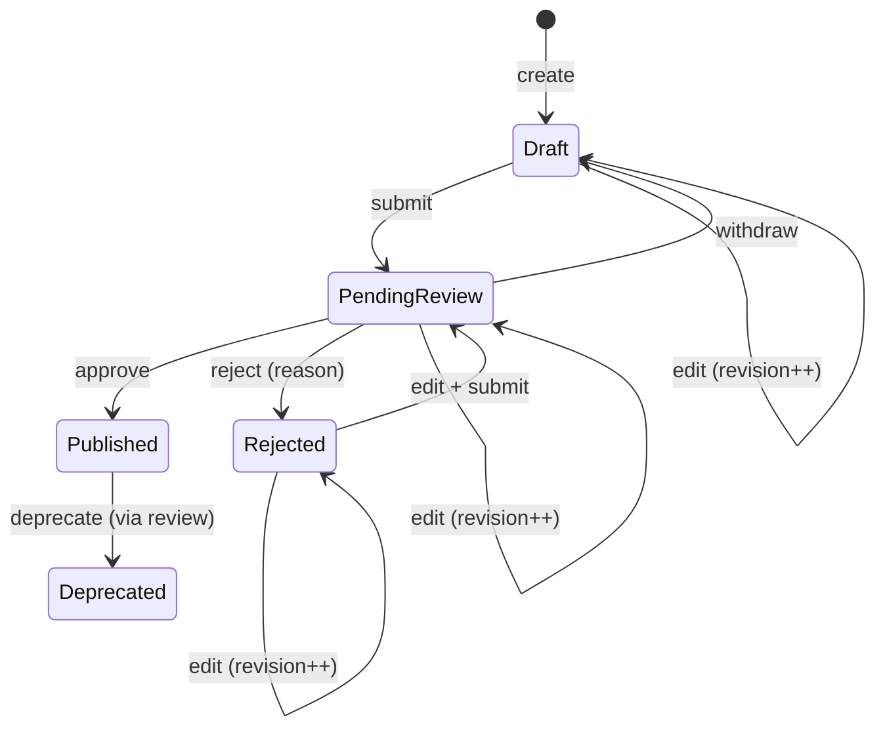

# ADR 0003 — Change-approval workflow

- **Status:** Proposed
- **Date:** 2026-05-02
- **Deciders:** @Haibread
- **Builds on:** [ADR 0001 — Workspaces under publishers](0001-workspaces-under-publishers.md), [ADR 0002 — Workspace OIDC group binding](0002-workspace-group-binding.md)

## TL;DR

Every create / edit / delete of a registry resource is reviewed before
it goes live.

- New `review_state` column on each version table (`none` |
  `pending_review` | `rejected`), **orthogonal** to existing `status`
  and `published_at`. Existing publish mechanism untouched.
- A `revision` integer monotonic across the version's lifetime
  supports PR-style continuous editing; approve/reject must carry the
  revision the reviewer last saw, mismatch → 409.
- One global reviewer Keycloak group `registry-reviewers` for v1
  (configurable). Per-workspace reviewer groups deferred (F1).
- Self-approval is permitted in v1 if a user is in both groups (F2).
- Public reads never expose pending content or any of the new audit
  columns.

## Phasing

This ADR depends on ADRs 0001 and 0002 having shipped: the
`review_state` column lives on version rows that are accessed via the
workspace-scoped paths from 0001, and the reviewer group is read from
the JWT claim infrastructure introduced in 0002.

## Context

After 0002, members of `workspaces.group_name` can write to their
workspace's resources. Without a review gate, those writes immediately
become visible on the public API, including the spec-compatible MCP
endpoints and the A2A `/.well-known/agent-card.json` URLs that
downstream consumers cache.

Decision I in CLAUDE.md already commits to a draft → published →
deprecated lifecycle on entries with immutable published versions;
this ADR adds the review step in front of the publish transition,
**without** disturbing the existing schema:

- `mcp_servers.status` ∈ `('draft', 'published', 'deprecated', 'deleted')` — entry-level lifecycle.
- `mcp_server_versions(server_id, status, published_at, …)` — `status`
  ∈ `('active', 'deprecated', 'deleted')`, `published_at` is the
  marker for "this version is live".
- Agents follow the same shape.

## Decision

### State machine

A new `review_state` column on each version row, **orthogonal** to
`status` and `published_at`:



State ↔ column mapping:

| Logical state    | `review_state`    | `published_at`    |
|------------------|-------------------|-------------------|
| Draft            | `none`            | `NULL`            |
| Pending review   | `pending_review`  | `NULL`            |
| Rejected         | `rejected`        | `NULL`            |
| Published        | `none`            | `NOT NULL`        |
| Deprecated       | `none`            | `NOT NULL` (entry `status='deprecated'`) |

Once a version has `published_at IS NOT NULL`, it is immutable. To
change a published entry, a publisher creates a **new** version row
in Draft and submits it; the old one stays published until the new
one is approved.

### `revision` is monotonic across the version's lifetime

`revision` starts at 1 and increments **on every content edit**,
regardless of `review_state`. That means a Draft → Pending review →
Rejected → Draft → Pending review cycle keeps growing the counter.
The rule is: any successful content PATCH bumps `revision` by exactly
one. State-only transitions (submit, withdraw, approve, reject) do
**not** bump revision. This makes the revision a stable identifier
for "the bytes the reviewer saw" no matter what the publisher did
between reviews.

### PR-style continuous editing

Publishers can keep editing a version while it sits in
`pending_review` without withdrawing it. The content-edit endpoint is
**not new** — it's the existing
`PATCH /v0/publishers/{p}/workspaces/{w}/servers/{s}/versions/{ver}`
(post-0001 hierarchical paths). It must:

- Authorize via `RequireWorkspaceWrite` (from 0002).
- Reject with 409 if the row has `published_at IS NOT NULL`.
- On a successful PATCH against any non-published row, bump `revision`.
- On a PATCH against a `rejected` row, leave `rejection_reason` as-is
  (the publisher is iterating; the next submit clears it).

A **partial unique index** prevents stacking — at most one
`pending_review` version per entry at a time:

```sql
CREATE UNIQUE INDEX mcp_server_versions_one_pending_idx
    ON mcp_server_versions (server_id)
    WHERE review_state = 'pending_review';
```

(Same on `agent_versions(agent_id)`.) A submit that violates this
index returns 409 with type
`urn:ai-registry:problem:review-already-pending`.

### Operations covered

| Operation | Mechanism                                                                     |
|-----------|-------------------------------------------------------------------------------|
| Create    | New entry's first version is created as Draft, submitted for review.          |
| Edit      | A new version row in Draft is created, submitted; replaces on approval.       |
| Delete    | A `deletion_requested_at` flag on the entry; reviewer confirms or clears.     |

Deprecation transitions (entry `status='published' → 'deprecated'`)
also go through the review queue, treated as a 1-field edit on the
entry.

### Reviewer group

**One global group** for v1, name configurable per CLAUDE.md (same
mechanism as `AUTH_GROUPS_CLAIM` in 0002):

| Env var                   | YAML key                | Default              |
|---------------------------|-------------------------|----------------------|
| `AUTH_REVIEWER_GROUP`     | `auth.reviewer_group`   | `registry-reviewers` |

The reviewer group is **separate** from any workspace's `group_name`
— "who can author" is decoupled from "who can approve". A user can be
in zero, one, or both. **Self-approval** (a user in both the workspace
group and the reviewer group approving their own submission) is
permitted in v1; F2 tracks tightening.

Admins (`realm_access.roles[] contains "admin"`) implicitly satisfy
the reviewer check.

### Submit / withdraw / reject / approve mechanics

- **Submit** (from Draft or Rejected) — sets
  `review_state='pending_review'`, `submitted_at=now()`,
  `submitted_by(_email)` from the JWT, clears `rejection_reason`. The
  partial unique index enforces "no other `pending_review` version on
  this entry". Does **not** bump `revision`.
- **Withdraw** (from Pending review) — sets `review_state='none'`,
  clears `submitted_at` / `submitted_by(_email)`. Does not bump
  `revision`.
- **Reject** (from Pending review) — sets `review_state='rejected'`,
  `reviewed_at=now()`, `reviewed_by(_email)`,
  `review_decision='rejected'`, `rejection_reason=<body.reason>`.
  Requires matching `revision`.
- **Approve** (from Pending review) — sets `published_at=now()` if not
  already set, marks the parent entry `status='published'` if it was
  `'draft'`, sets `review_state='none'`, `reviewed_at=now()`,
  `reviewed_by(_email)`, `review_decision='approved'`. Requires
  matching `revision`.

### Visibility

- **Public read endpoints** (workspace-scoped lists, ULID lookups, the
  spec-compatible MCP shape per CLAUDE.md decision C, the per-agent
  `/.well-known/agent-card.json`, the global
  `/.well-known/agent-card.json`) return only versions with
  `published_at IS NOT NULL AND status != 'deleted'` — same filter as
  today. They never return `review_state != 'none'` rows, never
  reveal pending deletions, and never expose any of the new audit
  columns or `review_state`.
- **Authenticated read endpoints** apply this rule, evaluated in
  order:
  - Admin → all states for all workspaces.
  - Reviewer group member → `pending_review` and pending deletions
    across all workspaces (the review queue), plus public.
  - Workspace group member → all states **only** for workspaces
    whose `group_name` the JWT carries.
  - Anyone else → public-only.
- An entry with a pending deletion stays visible on public reads
  until the deletion is approved, at which point it is soft-deleted
  via the `deleted_at` column added in this ADR.

### Schema additions

Migration number `000010_change_approval` is a placeholder; assigned
at PR open time.

On every entry-version row (`mcp_server_versions`, `agent_versions`):

```sql
ALTER TABLE mcp_server_versions
    ADD COLUMN review_state       text        NOT NULL DEFAULT 'none',
    ADD COLUMN revision           integer     NOT NULL DEFAULT 1,
    ADD COLUMN submitted_at       timestamptz,
    ADD COLUMN submitted_by       text,            -- JWT subject (UUID)
    ADD COLUMN submitted_by_email text,            -- denormalized at action time
    ADD COLUMN reviewed_at        timestamptz,
    ADD COLUMN reviewed_by        text,
    ADD COLUMN reviewed_by_email  text,
    ADD COLUMN review_decision    text,            -- 'approved' | 'rejected'
    ADD COLUMN rejection_reason   text;

ALTER TABLE mcp_server_versions
    ADD CONSTRAINT mcp_server_versions_review_state_chk
    CHECK (review_state IN ('none','pending_review','rejected'));

-- A non-'none' review_state implies the version is not yet published.
ALTER TABLE mcp_server_versions
    ADD CONSTRAINT mcp_server_versions_review_unpublished_chk
    CHECK (review_state = 'none' OR published_at IS NULL);

CREATE INDEX mcp_server_versions_review_state_idx
    ON mcp_server_versions (review_state)
    WHERE review_state != 'none';

CREATE UNIQUE INDEX mcp_server_versions_one_pending_idx
    ON mcp_server_versions (server_id)
    WHERE review_state = 'pending_review';
```

(Same on `agent_versions`, keyed on `agent_id`.)

On the entry rows:

```sql
ALTER TABLE mcp_servers
    ADD COLUMN deleted_at                  timestamptz,
    ADD COLUMN deletion_requested_at       timestamptz,
    ADD COLUMN deletion_requested_by       text,
    ADD COLUMN deletion_requested_by_email text;

CREATE INDEX mcp_servers_active_idx
    ON mcp_servers (id)
    WHERE deleted_at IS NULL;
```

(Same on `agents`.) Email denormalized at action time so later
Keycloak email changes don't rewrite history.

The down migration drops every column / constraint / index in
reverse order.

### API surface

**Existing endpoint, behavior changed:**

```
PATCH  /v0/publishers/{p}/workspaces/{w}/servers/{s}/versions/{ver}    workspace
       (now: bumps `revision` on any successful PATCH;
        rejected if version has published_at IS NOT NULL)
```

**New endpoints (mirrored for agents):**

```
POST   …/servers/{s}/versions/{ver}/submit         workspace
POST   …/servers/{s}/versions/{ver}/withdraw       workspace
POST   …/servers/{s}/versions/{ver}/approve        reviewer  body: { revision }
POST   …/servers/{s}/versions/{ver}/reject         reviewer  body: { revision, reason }
POST   …/servers/{s}/deletion-request              workspace
POST   …/servers/{s}/deletion-request/approve      reviewer
POST   …/servers/{s}/deletion-request/reject       reviewer  body: { reason }
```

All MUST be added to `server/api/openapi.yaml` per the API-first rule.

#### Approve / reject error model

The handler issues a single conditional UPDATE:

```sql
UPDATE mcp_server_versions
   SET …
 WHERE id = $1
   AND review_state = 'pending_review'
   AND revision = $body.revision
RETURNING …;
```

If 0 rows are updated, a follow-up SELECT discriminates the failure
mode:

| Diagnosis                                 | HTTP | RFC 7807 `type`                                            |
|-------------------------------------------|------|------------------------------------------------------------|
| Row not found                             | 404  | `urn:ai-registry:problem:not-found`                        |
| Row exists, `review_state != 'pending_review'` | 409 | `urn:ai-registry:problem:review-state-mismatch`         |
| Row exists, `revision` differs            | 409  | `urn:ai-registry:problem:review-revision-mismatch`         |

The admin UI uses the type URI to drive UX: revision-mismatch shows
"the version was edited since you loaded it, please re-read";
state-mismatch shows "this version is no longer pending review".

The same conditional-UPDATE pattern closes the
two-reviewers-approving-simultaneously race — one wins, the other
gets `review-state-mismatch`.

Deletion approve / reject use a similar pattern keyed on
`deletion_requested_at IS NOT NULL`; there's no revision counter on
deletion requests because the request has no editable content.

#### Response schema split

Per CLAUDE.md decision C, the spec-compatible MCP wire format is
strict. OpenAPI exposes **two** schemas per resource:

- `Server` / `Agent` — public, spec-compatible. No `reviewState`,
  `revision`, `submitted*` / `reviewed*` / `rejectionReason`, or
  pending-deletion fields.
- `ServerAdmin` / `AgentAdmin` — used by authenticated reads.

The two schemas reuse a common base via `allOf`.

### Authorization matrix

| Action                      | Required principal                                    |
|-----------------------------|-------------------------------------------------------|
| Create new entry / version  | Workspace group member OR admin                       |
| Edit Draft / Rejected       | Workspace group member OR admin (revision++)          |
| Edit Pending review         | Workspace group member OR admin (revision++)          |
| Submit                      | Workspace group member OR admin                       |
| Withdraw                    | Workspace group member OR admin                       |
| Approve / reject            | Reviewer group member OR admin (revision must match)  |
| Request deletion            | Workspace group member OR admin                       |
| Confirm / cancel delete     | Reviewer group member OR admin                        |

A new `RequireReviewer` middleware checks
`claims.IsAdmin() || claims.HasGroup(<configured reviewer group>)`.

### Audit

`audit_log` already records `actor_subject` and `actor_email` for
every HTTP call (see ADR 0002). The new columns on the version row
(`submitted_by(_email)`, `reviewed_by(_email)`, `review_decision`,
`rejection_reason`) are the durable audit record for state
transitions specifically, with email captured at action time.

## Consequences

### Positive

- No silent self-publishing.
- Existing publish mechanism untouched. Rollback is "drop the
  column".
- Public read API behavior is unchanged for downstream consumers.
- Auditable end-to-end.
- PR-style editing on `pending_review` removes the
  withdraw/resubmit dance; revision check + discriminated 409 keep
  reviewer decisions honest.
- Approve/reject is race-safe via a single conditional UPDATE.

### Negative

- Self-approval is allowed by design for v1.
- Deprecation now requires review, adding a step for a previously-
  cheap operation.
- The revision check adds a contract requirement on the admin UI:
  approve/reject buttons must remember the loaded `revision`.
- Resubmits on the same version row mean `submitted_at` /
  `submitted_by(_email)` reflect the **latest** submission. Per-call
  history lives in `audit_log`.
- Reviewers see pending content across all workspaces (one global
  group). Per-workspace reviewer groups are F1.
- **Rejected versions accumulate.** A version that's rejected and
  then abandoned sits indefinitely with `review_state='rejected'`. We
  accept this for v1 (volume is small). Cleanup options: a TTL job,
  or admins hard-delete via SQL. Tracked as F8.

### Neutral

- Admin override preserved across both middlewares.
- Pending changes never reach the public API, so cache invalidation
  for downstream consumers happens only on approval.

## Alternatives considered

1. **Separate `change_requests` table holding diff payloads.**
   Rejected: doubles the source of truth. The version row already
   gives "proposed content sitting next to live content" with
   `published_at IS NULL` as the divider.
2. **Per-resource-type reviewer groups from day one.** Deferred (F1).
3. **Forbid self-approval.** Deferred (F2) per explicit decision.
4. **Auto-approve when the actor is admin.** Rejected: admins should
   still click approve so the audit row is populated.
5. **Strict immutable `pending_review` (withdraw to edit).**
   Rejected: forces a withdraw/resubmit dance for trivial typo
   fixes.
6. **Auto-revert to Draft on any edit while Pending review.**
   Rejected: still forces an explicit re-submit on each edit.
7. **Replace existing `status`/`published_at` with a single new
   `state` enum.** Rejected: would clash with current CHECK
   constraints and force a rewrite of every read path.
8. **Bump revision only inside `pending_review`.** Rejected: a
   reviewer could approve a stale Draft after the publisher edited
   it during withdraw → edit → resubmit. Monotonic-across-lifetime
   makes the revision a global identifier.

## Out of scope (FUTURE WORK)

- **F1. Per-resource-type or per-workspace reviewer groups.**
- **F2. Forbid self-approval** (`submitted_by != reviewed_by`) once
  the reviewer group is no longer admin-adjacent.
- **F3. Notifications.** Email / webhook / Slack on submission /
  approval / rejection / deletion request.
- **F4. SLA timers.** Auto-escalate or auto-reject submissions that
  sit in `pending_review` past a threshold.
- **F5. Bulk approval.**
- **F6. Reviewer comments / discussion thread** on a pending
  version, beyond the single `rejection_reason` field.
- **F7. Diff view in the admin UI** between published / pending /
  successive `revision` values.
- **F8. Cleanup of long-abandoned `rejected` versions** — a TTL
  sweep or admin tooling.

## Implementation sketch

1. **Migration** adding `review_state`, `revision`, audit columns,
   both CHECK constraints, state index, partial unique pending-review
   index for `mcp_server_versions(server_id)` and
   `agent_versions(agent_id)`; deletion-request columns on
   `mcp_servers` and `agents`.
2. **Config key** `AUTH_REVIEWER_GROUP` (default
   `registry-reviewers`).
3. **`RequireReviewer` middleware**.
4. **Domain entities** gain a `ReviewState` enum and a `Revision`
   field. Public read repos unchanged. Authenticated repos take a
   `reviewStates []ReviewState` filter.
5. **Existing PATCH version handler** updated to bump `revision` on
   any successful edit; reject with 409 if published.
6. **New handlers** for submit / withdraw / approve / reject /
   deletion-request / deletion-confirm / deletion-cancel. Approve /
   reject use the single conditional UPDATE plus the discriminator
   SELECT for the 409 `type` URI.
7. **OpenAPI** — `Server` / `ServerAdmin` and `Agent` /
   `AgentAdmin` pairs, the seven new operations per resource type,
   explicit `404` and `409` responses with documented `type` URIs.
8. **Admin UI**:
   - review-queue page (list of `pending_review` versions filterable
     by workspace), approve / reject buttons that carry the loaded
     `revision` and surface 409 by re-fetching;
   - deletion-request inbox.
9. **Tests**:
   - state-machine transitions (legal vs illegal, including the
     "non-`none` `review_state` implies `published_at IS NULL`"
     constraint);
   - `RequireReviewer` matrix;
   - full submit→approve and submit→reject flows on MCP and agent
     endpoints, including edit-while-pending bumping `revision`;
   - 409 with `revision-mismatch` after a publisher edits during
     review;
   - 409 with `state-mismatch` when two reviewers approve
     simultaneously;
   - 404 path on a non-existent version;
   - public-read leakage check (pending content and admin-only
     fields never appear under the spec-compatible MCP shape or the
     `/.well-known/agent-card.json` endpoints).

## References

- [ADR 0001 — Workspaces under publishers](0001-workspaces-under-publishers.md).
- [ADR 0002 — Workspace OIDC group binding](0002-workspace-group-binding.md).
- [CLAUDE.md](../../CLAUDE.md) — version immutability (decision I),
  spec compatibility (decision C), API-first, configuration rule.
- [server/migrations/000001_init.up.sql](../../server/migrations/000001_init.up.sql) — current entry/version state model;
  table and column names.
